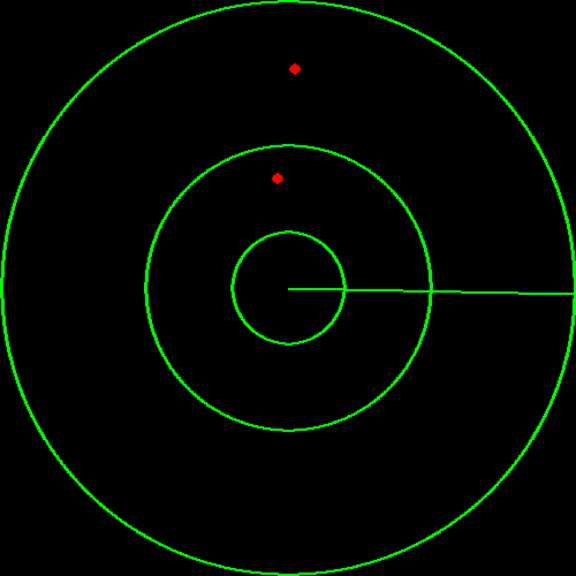

# PyGame radar 2D 

> Radar application, showing polar points. This application starts a new thread for the UI part allowing to use it inside an other script. 

## Dependencies
TODO 

## Use it
TODO 

## Examples

Simple example showing the plot of 2 random data 

